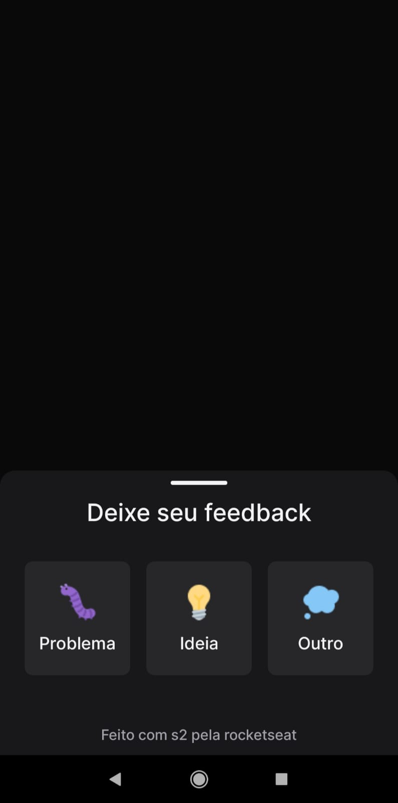
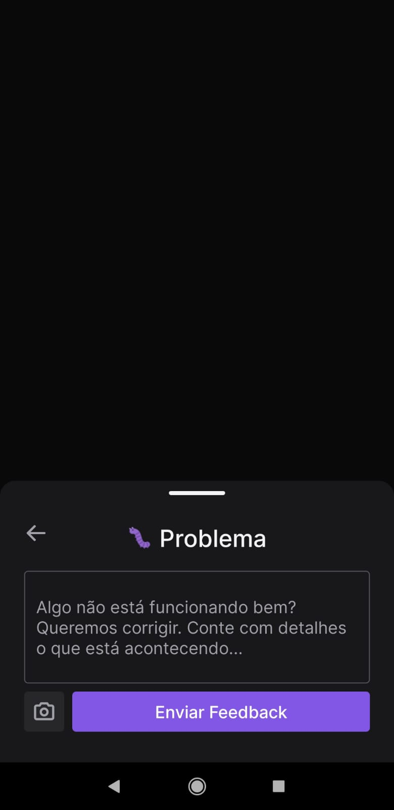
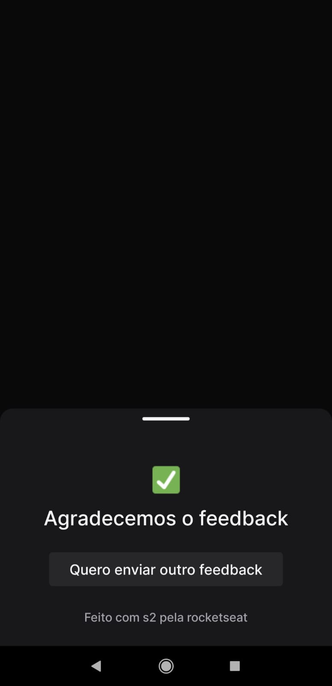

<div align='center'>
  
</div>

## Sobre o projeto 💬

O **nlw-return-impulse-mobile** é uma aplicação Mobile desenvolvida no nlw-return da rocketseat.

## Funcionalidades 🧠

A aplicação contém as seguintes funcionalidades:

### Index.tsx 📕

- [x] Envia um feedback para o suporte sobre o ocorrido, seja ele um bug, uma ideia ou outros tipos de assuntos.
- [x] Após o envio, um email é direcionado para que o suporte tenha noção sobre o feedback reportado.

## Pré-requisitos
#### Antes de começar, é bom ter instalado em sua maquina as seguintes ferramentas:
- [x] [GIT](https://git-scm.com/)
- [x] [VSCode](https://code.visualstudio.com/)
- [x] [NodeJs](https://nodejs.org/en/)
- [x] [Expo](https://docs.expo.dev/) 

### Rodando o Projeto 📖

```bash
# Clone para este repositório
$ git clone <https://github.com/Pedro-AugusCoelho/nlw-return-impulse-mobile.git>

# Acesse a pasta do projeto no terminal/cmd
$ cd nlw-return-impulse-mobile

# Instale as dependências
$ npm/yarn install

# Execute a aplicação em modo de desenvolvimento
$ expo start

# O servidor iniciará na porta:19002 - acesse <http://localhost:19002>
 
```

## Imagens sobre o projeto

<div align='center'>

  
  
  
 
  

</div>

## Tecnologias 🛠

Desenvolvido utilizando as seguintes tecnologias:

- [REACT-NATIVE](https://reactnative.dev/)
- [TYPESCRIPT](https://www.typescriptlang.org/)
- [EXPO](https://docs.expo.dev/)
- [AXIOS](https://www.npmjs.com/package/axios)
- [PHOSPHOR](https://www.npmjs.com/package/phosphor-react-native)
- [BOTTOM SHEET](https://gorhom.github.io/react-native-bottom-sheet/)
- [FIGMA](https://www.figma.com/)

## Desenvolvido ##

- [Rocketseat](https://www.rocketseat.com.br/index)

****************

<p align="center">Feito por: Pedro Augusto 🧑🏽🤙🏽</p>
